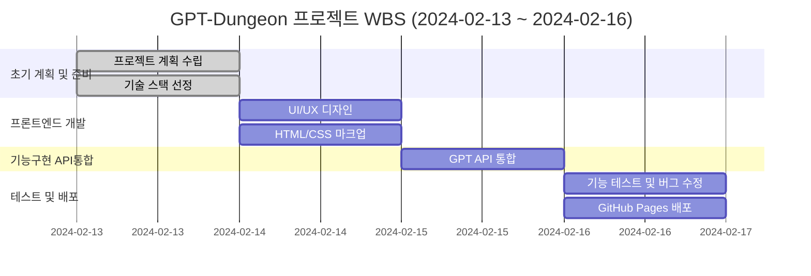
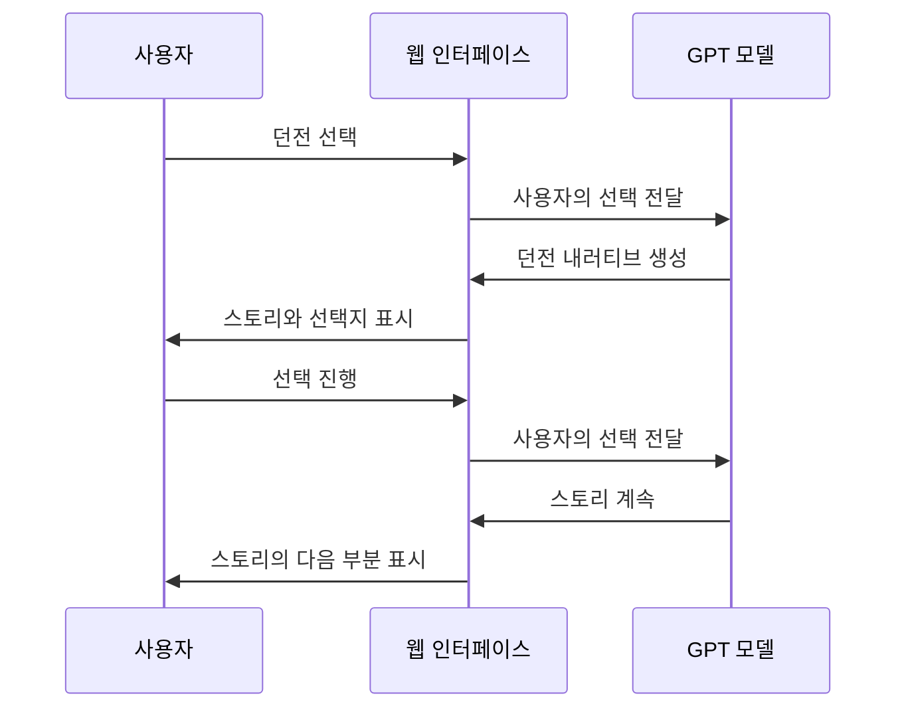
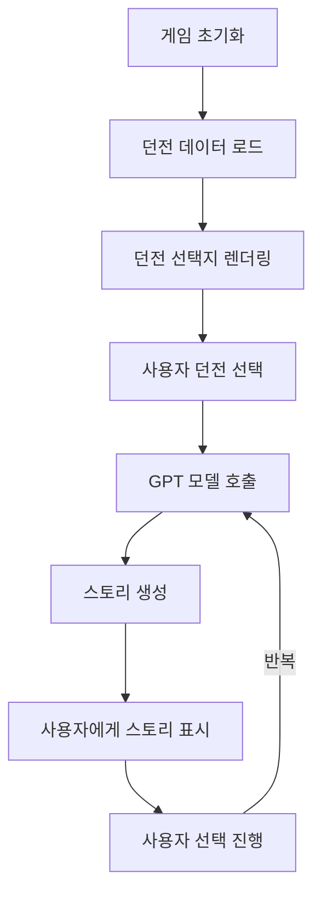
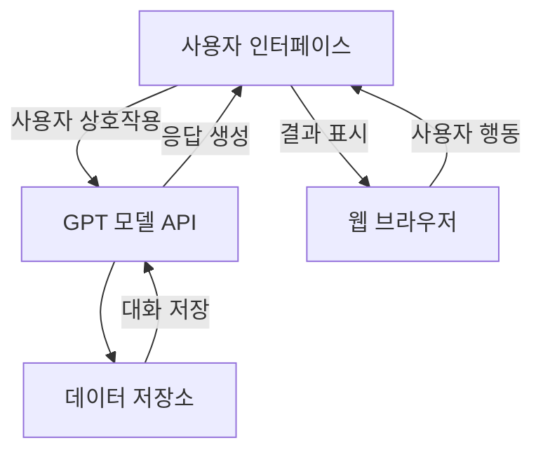

# Gpt-Dungeon-final

## 프로젝트 소개

GPT-Dungeon은 사용자가 대화형 인터페이스를 통해 다양한 가상의 던전을 탐험할 수 있는 웹 기반 어플리케이션입니다. GitHub 페이지를 활용하여 쉽게 접근 가능한 이 프로젝트는,
최신 GPT 모델을 이용해 풍부하고 몰입감 있는 스토리텔링 경험을 제공합니다.

## 목표

- **접근성 높은 던전 탐험 게임 제공:** GitHub 페이지를 통해 누구나 쉽게 접근하고 즐길 수 있습니다.
- **대화형 스토리텔링:** GPT 모델을 활용하여 사용자의 선택에 따라 달라지는 스토리라인을 제공합니다.
- **교육적 활용:** 프로그래밍 및 인공지능 기술 학습에 대한 흥미를 유발할 수 있는 콘텐츠를 제공합니다.

## 사용 방법

1. **웹사이트 접속:** [GPT-Dungeon GitHub 페이지](https://github.com/username/gpt-dungeon)에 접속합니다.
2. **던전 선택:** 제공되는 던전 이미지 중 하나를 선택하여 탐험을 시작합니다.
3. **대화 진행:** GPT-Dungeon과의 대화를 통해 스토리를 진행시킵니다. 선택지를 선택하거나 질문에 답하여 던전을 탐험하세요.

## 기술 스택

- **프론트엔드:** HTML, CSS, JavaScript
- **AI 모델:** OpenAI GPT
- **호스팅:** GitHub Pages
- **사용 라이브러리:** jQuery(https://jquery.com/), Font Awesome(https://fontawesome.com/)

## WBS

## 사용자 상호작용 흐름

## 의존성 그래프

## 시스템 아키텍쳐

## 개발 히스토리

프로젝트는 2024년 초, 대화형 스토리텔링과 인공지능의 결합에 대한 관심에서 시작되었습니다. 개발 과정은 여러 단계의 아이디어 도출, 기술 검토, 프로토타입 제작을 거쳐, 최종적으로 사용자가 즐길 수 있는 상호작용형 게임으로 완성되었습니다.

## 개발 동기

CHatGPT등장 당시에 GPT에게 여러가지 프롬프트를 입력하면서 즐겁게 사용했던 기억이 동기가 되었습니다,딱딱하지 않게 AI를 사용하면 좀더 친숙해질수 있지 않을까 라는 생각으로 프로젝트를 만들었습니다.

## 느꼈던 점

- 프로젝트를 통해 창의적인 해결책을 모색하는 경험을 했습니다.
- 거의 문외한이였던 프론트엔드 사용법을 단기간에 많이 감을 익히게 해준 프로젝트였습니다.
- 실제로 생각을 구현해봄으로서 그동안 많이 신경쓰지않았던 문서작성,정교한 코드에대한 많은 생각을 느끼게 해준 프로젝트였습니다.
- 기간을 정해놓고,실제 그 기간동안에 구현하는 연습을 함으로서 개인적인 공부방향성에대한 많은 경험을 제공해준 프로젝트였습니다.
- GPT를 개인적으로 사용할때는 프롬프트의 중요성을 인지하지 못 했으나,이번 프로젝트를 통해 AI활용서비스에 프롬프트의 중요성이 매우 크다는 것을 느끼게 해줬습니다.

## 개선할 점

- 프론트엔드가 문외한이였던것 만큼 또 초보개발자인 만큼,시멘틱하지 못했던 태그구성과 깨끗하지못한 코드들은 개선하고 싶습니다.
- 프로젝트 진행 기간 설정과 기간안에서의 시간배분이 효율적이지 못했던점 개선이 필요하다고 생각합니다.
- 일부 버그나 잘못된 기능을 발견했음에도 수정하지 못했던점이 아쉽습니다.

## 프로젝트를 진행하면서 집중했던 점

- 프론트쪽에서 중요하게 생각하는 화면사이즈에 따른 동적인 움직임에 신경을 썼던것 같습니다.
- 미숙한 기술이나 지식을 최대한 빨리 학습하고 최대한 많이 사용하려고 하는 것에 신경을 많이 썼습니다.
- 미숙한 기술을 사용하려다보니 AI와 검색을 적극 사용했던것같습니다.AI의 활용에 더욱 익숙해졌던 시간이였습니다.

