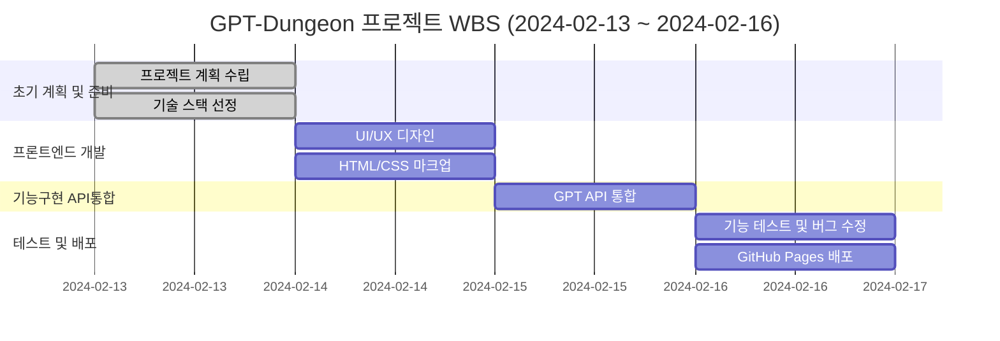
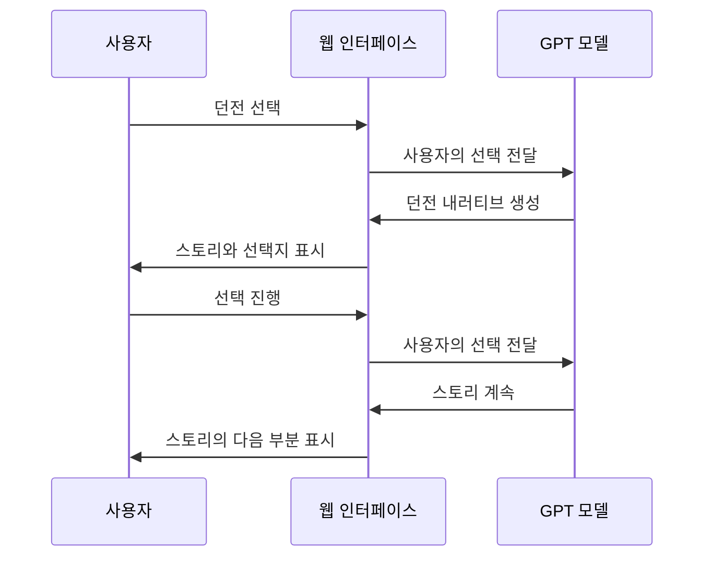
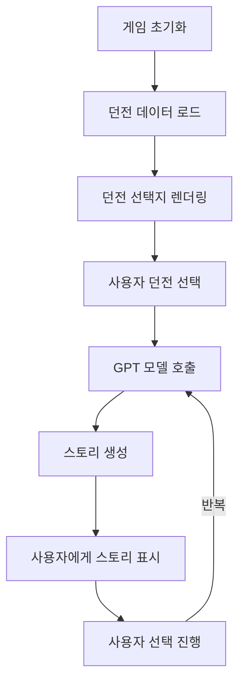
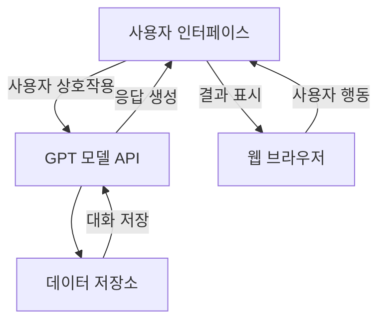

# Gpt-Dungeon-final

## 프로젝트 소개

GPT-Dungeon은 사용자가 대화형 인터페이스를 통해 다양한 가상의 던전을 탐험할 수 있는 웹 기반 어플리케이션입니다. GitHub 페이지를 활용하여 쉽게 접근 가능한 이 프로젝트는, 최신 GPT 모델을 이용해 풍부하고 몰입감 있는 스토리텔링 경험을 제공합니다.

## 목표

- **접근성 높은 던전 탐험 게임 제공:** GitHub 페이지를 통해 누구나 쉽게 접근하고 즐길 수 있습니다.
- **대화형 스토리텔링:** GPT 모델을 활용하여 사용자의 선택에 따라 달라지는 스토리라인을 제공합니다.
- **교육적 활용:** 프로그래밍 및 인공지능 기술 학습에 대한 흥미를 유발할 수 있는 콘텐츠를 제공합니다.

## 사용 방법

1. **웹사이트 접속:** [GPT-Dungeon GitHub 페이지](https://github.com/username/gpt-dungeon)에 접속합니다.
2. **던전 선택:** 제공되는 던전 이미지 중 하나를 선택하여 탐험을 시작합니다.
3. **대화 진행:** GPT-Dungeon과의 대화를 통해 스토리를 진행시킵니다. 선택지를 선택하거나 질문에 답하여 던전을 탐험하세요.

## 기술 스택

- **프론트엔드:** HTML, CSS, JavaScript
- **AI 모델:** OpenAI GPT
- **호스팅:** GitHub Pages

  ## WBS

## 사용자 상호작용 흐름

## WBS

## 의존성 그래프

## 시스템 아키텍쳐

